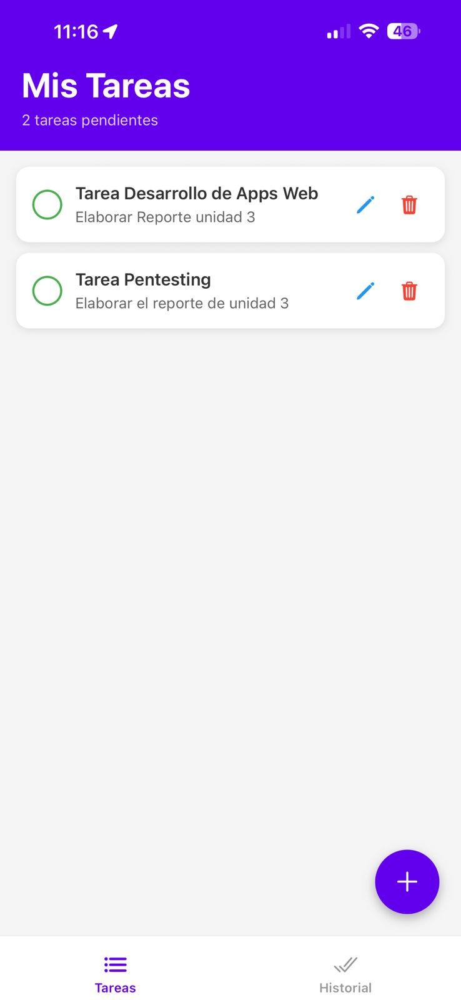
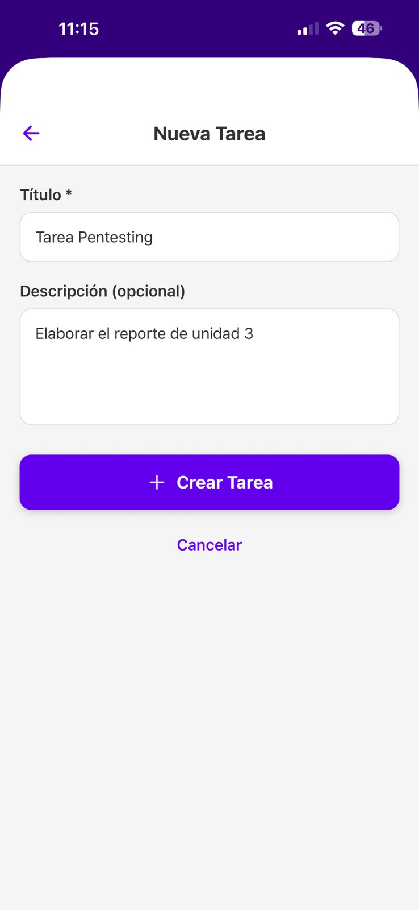

# Movies Explorer - App de Consulta de Películas

## 1. Identificación del Proyecto

- **Nombre de la App:** Movies Explorer
- **Asignatura/Profesor:** Desarrollo de Aplicaciones Móviles / M.C. Leonel González Vidales
- **Periodo/Fecha:** Septiembre 2025
- **URL del Repositorio:** https://github.com/l3onet/movies-explorer-app

## 2. Descripción del Proyecto

Movies Explorer es una aplicación móvil desarrollada con React Native y Expo que permite a los usuarios explorar una cartelera de películas con información detallada. La aplicación cuenta con una interfaz moderna con tema oscuro y navegación fluida entre pantallas.

### Características Principales:
- 📱 **Cartelera de Películas**: Lista de películas con información básica
- 🎬 **Detalles de Película**: Vista detallada con sinopsis, género y calificación
- 🎨 **Interfaz Moderna**: Diseño con tema oscuro y componentes estilizados
- 🧭 **Navegación Intuitiva**: Sistema de navegación stack con transiciones suaves
- 📊 **Datos de Ejemplo**: Películas precargadas para demostración

### Funcionalidades Implementadas:
- Lista de películas con tarjetas informativas
- Pantalla de detalles con información completa
- Navegación entre pantallas con botón de regreso
- Diseño responsivo y optimizado para móviles
- Estructura de código modular y escalable

## 3. Tecnologías y Versiones Utilizadas

### Stack Tecnológico:
- **React Native:** 0.81.4
- **React:** 19.1.0
- **Expo:** ~54.0.3
- **React Navigation:** v7.1.17 (Native Stack v7.3.26)
- **React Native Screens:** ~4.16.0
- **React Native Safe Area Context:** ~5.6.0

### Herramientas de Desarrollo Requeridas:

- **Node.js:** v18.17.0 o superior
  ```bash
  node --version
  ```
- **NPM:** 9.0.0+ o Yarn v1.22.19+
  ```bash
  npm --version
  # o
  yarn --version
  ```
- **Expo CLI:** v6.3.0+
  ```bash
  npx expo --version
  ```
- **Android Studio:** v2022.3+ con Android SDK 33+ **o** Expo Go app en dispositivo físico
  ```bash
  # Verificar Android SDK
  adb --version
  ```

### Verificación de Entorno:
```bash
npx expo doctor
```

## 4. Estructura del Proyecto

### Organización de Archivos:
```
peliculas/
├── App.js                          # Componente principal de la aplicación
├── app.json                        # Configuración de Expo
├── package.json                    # Dependencias y scripts
├── index.js                        # Punto de entrada
├── assets/                         # Recursos estáticos
│   ├── adaptive-icon.png
│   ├── favicon.png
│   ├── icon.png
│   └── splash-icon.png
└── src/
    ├── components/                 # Componentes reutilizables
    │   └── Navigation/
    │       ├── IconBack.js
    │       └── index.js
    ├── navigations/                # Configuración de navegación
    │   ├── AppNavigation.js
    │   ├── HandlerNavigation.js
    │   ├── index.js
    │   └── Styles.styles.js
    ├── screens/                    # Pantallas de la aplicación
    │   └── Movies/
    │       ├── index.js
    │       ├── MovieDetailScreen.js
    │       └── MoviesListScreen.js
    └── utils/                      # Utilidades y constantes
        ├── index.js
        └── screens.js
```

### Arquitectura de la Aplicación:
- **App.js**: Componente raíz con NavigationContainer
- **AppNavigation.js**: Configuración del Stack Navigator
- **MoviesListScreen.js**: Pantalla principal con lista de películas
- **MovieDetailScreen.js**: Pantalla de detalles de película individual
- **screens.js**: Constantes para nombres de pantallas

## 5. Instalación y Configuración

### Instalación de Dependencias:
```bash
# Clonar el repositorio
git clone https://github.com/l3onet/movies-explorer-app
cd movies-explorer-app

# Instalar dependencias
npm install
```

### Dependencias del Proyecto:

| Dependencia | Versión | Propósito |
|-------------|---------|-----------|
| `@react-navigation/native` | ^7.1.17 | Core de navegación entre pantallas, manejo de estado de navegación |
| `@react-navigation/native-stack` | ^7.3.26 | Stack navigator para navegación jerárquica (Lista → Detalles) |
| `react-native-screens` | ~4.16.0 | Optimización de rendimiento para transiciones nativas |
| `react-native-safe-area-context` | ~5.6.0 | Manejo de áreas seguras (notch, barras de estado) |
| `expo-status-bar` | ~3.0.8 | Control de apariencia de barra de estado |
| `expo` | ~54.0.3 | Framework de desarrollo móvil |
| `react` | 19.1.0 | Biblioteca de interfaz de usuario |
| `react-native` | 0.81.4 | Framework de desarrollo móvil multiplataforma |

### Verificar instalación:
```bash
npm list --depth=0
```

## 6. Ejecución de la Aplicación

### Scripts Disponibles:
```bash
# Iniciar servidor de desarrollo
npm start
# o
npx expo start

# Ejecutar en Android (emulador/dispositivo)
npm run android
# o
npx expo start --android

# Ejecutar en iOS (solo macOS)
npm run ios
# o  
npx expo start --ios

# Ejecutar en web
npm run web
# o
npx expo start --web
```

### Primera Ejecución:
1. **Instalar dependencias:**
   ```bash
   npm install
   ```

2. **Iniciar el servidor de desarrollo:**
   ```bash
   npm start
   ```

3. **Conectar dispositivo:**
   - **Android:** Usar Expo Go o emulador
   - **iOS:** Usar Expo Go o simulador
   - **Web:** Se abrirá automáticamente en el navegador

### Notas de Entorno:
- **Emulador Android:** Debe estar iniciado antes de ejecutar `npm run android`
- **Dispositivo físico:** Usar Expo Go y escanear QR code
- **Túnel para redes restrictivas:** `npx expo start --tunnel`

## 7. Funcionalidades de la Aplicación

### Pantalla Principal (MoviesListScreen):
- **Lista de Películas**: Muestra una colección de películas en formato de tarjetas
- **Información Básica**: Título, año, género y calificación de cada película
- **Navegación**: Toca cualquier película para ver detalles completos
- **Diseño**: Interfaz con tema oscuro y tarjetas estilizadas



### Pantalla de Detalles (MovieDetailScreen):
- **Información Completa**: Título, año, género y calificación detallada
- **Sinopsis**: Descripción completa de la película
- **Botones de Acción**: 
  - "Ver Trailer" (funcionalidad preparada para implementar)
  - "Agregar a Favoritos" (funcionalidad preparada para implementar)
- **Navegación**: Botón de regreso para volver a la lista



### Datos de Ejemplo Incluidos:
- Avatar: The Way of Water (2022)
- Top Gun: Maverick (2022)
- Black Panther: Wakanda Forever (2022)
- Jurassic World Dominion (2022)

### Características Técnicas:
- **Navegación Stack**: Transiciones suaves entre pantallas
- **Diseño Responsivo**: Optimizado para diferentes tamaños de pantalla
- **Tema Oscuro**: Interfaz moderna con colores oscuros
- **Componentes Modulares**: Código organizado y reutilizable

## 8. Desarrollo y Extensión

### Próximas Funcionalidades Sugeridas:
- **Integración con API**: Conectar con TMDB o similar para datos reales
- **Sistema de Favoritos**: Persistencia local con AsyncStorage
- **Búsqueda**: Filtrado y búsqueda de películas
- **Categorías**: Organización por géneros
- **Trailers**: Integración con YouTube API
- **Notificaciones**: Alertas de nuevas películas

### Estructura para Nuevas Pantallas:
```javascript
// Ejemplo de nueva pantalla
export function NewScreen() {
  const navigation = useNavigation();
  
  return (
    <View style={styles.container}>
      {/* Contenido de la pantalla */}
    </View>
  );
}
```

### Agregar Nuevas Rutas:
1. Actualizar `src/utils/screens.js` con nuevas constantes
2. Agregar Screen en `src/navigations/AppNavigation.js`
3. Crear componente en `src/screens/`

## 9. Troubleshooting

### Problemas Comunes:
| Problema | Solución |
|----------|----------|
| **Error de instalación** | `npm install --legacy-peer-deps` |
| **Metro cache corrupto** | `npx expo start --clear` |
| **Puerto ocupado** | `npx expo start --port 8082` |
| **Dependencias desactualizadas** | `npx expo doctor` |

### Comandos Útiles:
```bash
# Verificar entorno
npx expo doctor

# Limpiar cache
npx expo start --clear

# Reinstalar dependencias
rm -rf node_modules package-lock.json && npm install
```

## 10. Recursos y Documentación

- [Documentación de Expo](https://docs.expo.dev/)
- [React Navigation](https://reactnavigation.org/)
- [React Native Docs](https://reactnative.dev/)
- [Expo Components](https://docs.expo.dev/versions/latest/)

---

**Desarrollado por:** Leonel Gonzalez Vidales 
**Última actualización:** 3 de octubre 2025  
**Versión:** 1.1.0