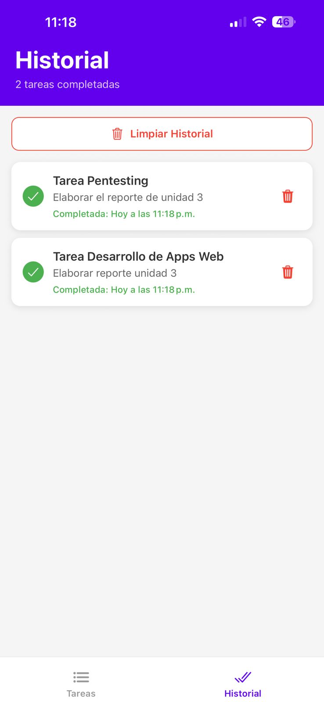

# FableTask - App de Lista de Tareas Diarias

## 1. Identificación del Proyecto

- **Nombre de la App:** FableTask
- **Asignatura/Profesor:** Desarrollo de Aplicaciones Móviles / M.C. Leonel González Vidales
- **Periodo/Fecha:** Septiembre 2025
- **URL del Repositorio:** https://github.com/Paninipy/FableTask

## 2. Descripción del Proyecto

FableTask es una aplicación móvil que permite a los usuarios capturar, organizar y revisar sus tareas diarias de manera efectiva. La aplicación se centra en una interfaz minimalista y fluida que facilita la interacción constante sin distracciones.

### Características Principales:
- ✅ **Gestión Completa de Tareas**: Permite crear, editar y eliminar tareas activas con facilidad
- 🎯 **Marcado Rápido**: Opción simple para marcar tareas como completadas
- 📜 **Historial de Logros**: Pantalla dedicada para revisar todas las tareas finalizadas
- 🎨 **Interfaz Simple y Moderna**: Diseño limpio y enfocado en la usabilidad
- ⚙️ **Manejo de Estado con Context**: Utiliza la Context API de React para una gestión de estado global de las tareas

### Funcionalidades Implementadas:
- Lista principal de tareas pendientes y activas
- Formulario reutilizable para añadir nuevas tareas y editar existentes
- Navegación por pestañas para alternar entre Tareas y Historial
- Persistencia de datos de las tareas mientras la app está activa
- Estructura de código modular y escalable

## 3. Tecnologías y Versiones Utilizadas

### Stack Tecnológico:
- **React Native:** 0.81.4
- **React:** 19.1.0
- **Expo:** ~54.0.3
- **React Navigation:** v7.1.17 (Native Stack, Tab Navigation)
- **React Native Screens:** ~4.16.0
- **React Native Safe Area Context:** ~5.6.0
- **React Context API**: Para la gestión de las listas de tareas

### Herramientas de Desarrollo Requeridas:

- **Node.js:** v18.17.0 o superior
  ```bash
  node --version
  ```
- **NPM:** 9.0.0+ o Yarn v1.22.19+
  ```bash
  npm --version
  # o
  yarn --version
  ```
- **Expo CLI:** v6.3.0+
  ```bash
  npx expo --version
  ```
- **Android Studio:** v2022.3+ con Android SDK 33+ **o** Expo Go app en dispositivo físico
  ```bash
  # Verificar Android SDK
  adb --version
  ```

### Verificación de Entorno:
```bash
npx expo doctor
```

## 4. Estructura del Proyecto

### Organización de Archivos:
```
FableTask/
├── App.js                          # Componente principal que envuelve el Context y la Navegación
├── app.json                        # Configuración de Expo
├── package.json                    # Dependencias y scripts
├── index.js                        # Punto de entrada
├── assets/                         # Recursos estáticos
└── src/
    ├── components/                 # Componentes reutilizables (Botón de Tarea, etc.)
    ├── context/                    # Lógica de gestión de estado global
    │   ├── index.js
    │   └── TasksContext.js         # Contexto que maneja las tareas activas y completadas
    ├── navigations/                # Configuración de navegadores (Tabs y Stack)
    │   ├── AppNavigation.js        # Navegación Stack principal (para agregar/editar)
    │   ├── index.js
    │   └── TabNavigation.js        # Navegación por Pestañas (Tareas y Historial)
    ├── screens/                    # Pantallas de la aplicación
    │   └── Tasks/
    │       ├── AddTaskScreen.js    # Pantalla para crear/editar tareas
    │       ├── HistoryScreen.js    # Pantalla que muestra tareas completadas
    │       ├── index.js
    │       └── TasksListScreen.js  # Pantalla principal con la lista de pendientes
    └── utils/                      # Utilidades y constantes
       ├── index.js
       └── screens.js               # Constantes para nombres de rutas
```

### Arquitectura de la Aplicación:
- **TasksContext.js**: Fuente única de verdad para la lista de tareas.

- **TabNavigation.js**: Define las dos vistas principales: Tareas Pendientes y Tareas Completadas (Historial).

- **AppNavigation.js*: Gestiona las transiciones a pantallas de formulario (AddTaskScreen) desde la vista de tareas.

- **TasksListScreen.js**: Pantalla central para interactuar con las tareas activas.

## 5. Instalación y Configuración

### Instalación de Dependencias:
```bash
# Clonar el repositorio
git clone https://github.com/Paninipy/FableTask
cd FableTask
```

## 6. API Local (Backend)

La app usa una API simple en **Node.js + Express** para administrar
tareas.

### 📌 Estructura básica de la API:
```
api/
├── package-lock.json
├── package.json
├── server.js
└── tasks_data.json
```

### 📌 Para ejecutar la API:
```bash
    cd server
    npm install
    node server.js
```

La API corre en:

    http://<tu-ip-local>:3000

### 📌 Configurar la API al clonar el proyecto

En el archivo:

    src/context/TasksContext.js

Modifica la constante:

``` js
export const API_URL = "http://TU-IP-LOCAL:3000";
```

> **Nota:** Si quieres ocultar tu IP, puedes usar
> `http://localhost:3000` cuando uses emulador Android o un túnel de
> Expo.

------------------------------------------------------------------------

## 7. Generación de APK con EAS

### 1️⃣ Instalar EAS CLI
```bash
    npm install -g eas-cli
```
### 2️⃣ Configurar EAS

    eas build:configure

Selecciona **Android**.

### 3️⃣ Crear la APK

    eas build -p android --profile apk

### 4️⃣ Descargar tu APK

EAS te dará un enlace como:

    https://expo.dev/artifacts/eas/xxxxxxx.apk

Descárgalo y colócalo en:

    Fabletask/builds/

------------------------------------------------------------------------

## 8. Documentación para Instalar la APK

1.  Transferir el archivo `FableTask.apk` al dispositivo.
2.  Activar *Instalar apps de fuentes desconocidas*.
3.  Abrir el archivo y seguir instrucciones.
4.  La app estará disponible en el cajón de aplicaciones.

------------------------------------------------------------------------


# Instalar dependencias
npm install
```

### Dependencias del Proyecto:

| Dependencia | Versión | Propósito |
|-------------|---------|-----------|
| `@react-navigation/native` | ^7.1.17 | Core de navegación entre pantallas, manejo de estado de navegación |
| `@react-navigation/native-stack` | ^7.3.26 | Stack navigator para navegación jerárquica (Lista → Detalles) |
| `react-native-screens` | ~4.16.0 | Optimización de rendimiento para transiciones nativas |
| `react-native-safe-area-context` | ~5.6.0 | Manejo de áreas seguras (notch, barras de estado) |
| `expo-status-bar` | ~3.0.8 | Control de apariencia de barra de estado |
| `expo` | ~54.0.3 | Framework de desarrollo móvil |
| `react` | 19.1.0 | Biblioteca de interfaz de usuario |
| `react-native` | 0.81.4 | Framework de desarrollo móvil multiplataforma |

### Verificar instalación:
```bash
npm list --depth=0
```

## 9. Ejecución de la Aplicación

### Scripts Disponibles:
```bash
# Iniciar servidor de desarrollo
npm start
# o
npx expo start

# Ejecutar en Android (emulador/dispositivo)
npm run android
# o
npx expo start --android

# Ejecutar en iOS (solo macOS)
npm run ios
# o  
npx expo start --ios

# Ejecutar en web
npm run web
# o
npx expo start --web
```

### Primera Ejecución:
1. **Instalar dependencias:**
   ```bash
   npm install
   ```

2. **Iniciar el servidor de desarrollo:**
   ```bash
   npm start
   ```

3. **Conectar dispositivo:**
   - **Android:** Usar Expo Go o emulador
   - **iOS:** Usar Expo Go o simulador
   - **Web:** Se abrirá automáticamente en el navegador

### Notas de Entorno:
- **Emulador Android:** Debe estar iniciado antes de ejecutar `npm run android`
- **Dispositivo físico:** Usar Expo Go y escanear QR code
- **Túnel para redes restrictivas:** `npx expo start --tunnel`

## 7. Funcionalidades de la Aplicación

### Pantalla Principal - Tareas Activas (TasksListScreen):
- **Lista de Tareas**: Muestra todas las tareas pendientes.

- **Acciones**: Botones para marcar como completada, editar o eliminar.

- **Creación de tareas**: Acceso rápido a la pantalla de formulario.

<div align="center">
  
</div>

### Pantalla de Formulario de Tareas (AddTaskScreen):
- **Creación y Edición**: Pantalla modular que se utiliza tanto para agregar nuevas tareas como para editar las existentes.

- **Input de Texto**: Campo para introducir la descripción de la tarea.

- **Botones de Acción**: Botón "Guardar" o "Actualizar" para aplicar cambios y regresar a la lista.

- **Botón de Eliminación**: Disponible para borrar tareas existentes.

<div align="center">
  
</div>

### Pantalla de Historial (HistoryScreen):
- **Registro de Tareas**: Muestra todas las tareas marcadas como completadas.

- **Limpiar Historial**: Opción para limpiar el historial de tareas completadas.

<div align="center">
  
</div>
### Características Técnicas:
- **Navegación por Pestañas**: Permite cambiar rápidamente entre Tareas Activas e Historial.
- **Gestión de Estado**: Toda la lógica de tareas está centralizada en el Context, facilitando la adición de persistencia.
- **Diseño Responsivo**: Optimizado para diferentes tamaños de pantalla móvil.
- **Componentes Modulares**: Código organizado y reutilizable

## 10. Desarrollo y Extensión

### Próximas Funcionalidades Sugeridas:
- **Persistencia de Datos**: Usar AsyncStorage o Firebase para que las tareas se guarden permanentemente.

- **Filtros/Ordenación**: Opciones para ordenar por fecha de creación o prioridad (si se añade el campo).

- **Notificaciones**: Alertas para recordar tareas pendientes.

### Estructura para Nuevas Pantallas:
```javascript
// Ejemplo de nueva pantalla
export function SettingsScreen() {
  const navigation = useNavigation();
  
  return (
    <View style={styles.container}>
      {/* Contenido de la pantalla */}
    </View>
  );
}

```

### Agregar Nuevas Rutas:
1. Actualizar `src/utils/screens.js` con nuevas constantes.

2. Agregar la nueva Screen en `src/navigations/TabNavigation.js` (si es una pestaña principal) o `src/navigations/AppNavigation.js` (si es una sub-pantalla).

3. Crear el componente en `src/screens/`

## 11. Troubleshooting

### Problemas Comunes:
| Problema | Solución |
|----------|----------|
| **Error de instalación** | `npm install --legacy-peer-deps` |
| **Metro cache corrupto** | `npx expo start --clear` |
| **Puerto ocupado** | `npx expo start --port 8082` |
| **Dependencias desactualizadas** | `npx expo doctor` |

### Comandos Útiles:
```bash
# Verificar entorno
npx expo doctor

# Limpiar cache
npx expo start --clear

# Reinstalar dependencias
rm -rf node_modules package-lock.json && npm install
```

## 12. Recursos y Documentación

- [Documentación de Expo](https://docs.expo.dev/)
- [React Navigation](https://reactnavigation.org/)
- [React Native Docs](https://reactnative.dev/)
- [Expo Components](https://docs.expo.dev/versions/latest/)

---
